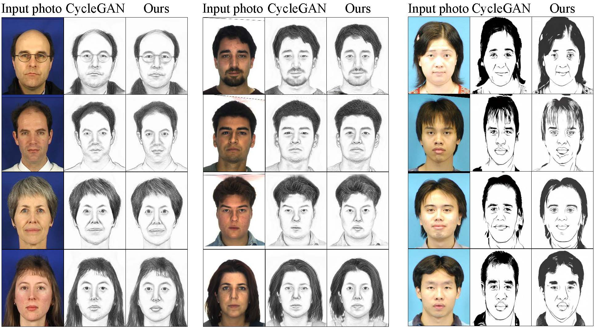

## Prerequisites
- Python 3
- CPU or NVIDIA GPU + CUDA

## Getting Started
### Installation

- Clone this repo:
```bash
git clone https://github.com/qinghew/SDGAN
cd SDGAN
pip install -r requirements.txt
```


### SDGAN train/test
- Train a model:
```bash
python train.py --dataroot dataset_root --name SDGAN
```
- The training results and loss plots are saved to here: `./results/SDGAN`. cd there, run `tensorboard --logdir=./ --port=6006` and click the URL http://localhost:6006.


- Test the model:
```bash
#!./scripts/test_cyclegan.sh
python test.py --dataroot dataset_root --name SDGAN --gpu_ids 0 --aspect_ratio 0
```
- The test results will be saved to here: `./results/SDGAN/test_latest/`.


### Model
- SDGAN:


- Omni-directional pixel-gradient convolution kernel:


### Results show
- Results on photo→sketch:


- Results on sketch→photo:


- Results on APDrawing⇔photo:


- Results on wild data:


- Results on the constructed unpaired datasets:



## Citation
If you use this code for your research, please cite our papers.
```
@article{wang2022SDGAN,
  title={Self-Discriminative Cycle Generative Adversarial Networks for Face Image Translation},
  author={Wang, Qinghe and Cao, Bing and Zhu, Pengfei and Wang, Nannan and Hu, Qinghua and Gao, Xinbo},
  journal={SCIENTIA SINICA Informationis},
  pages={DOI: 10.1360/SSI-2021-0321}, 
  year={2022}
}
```